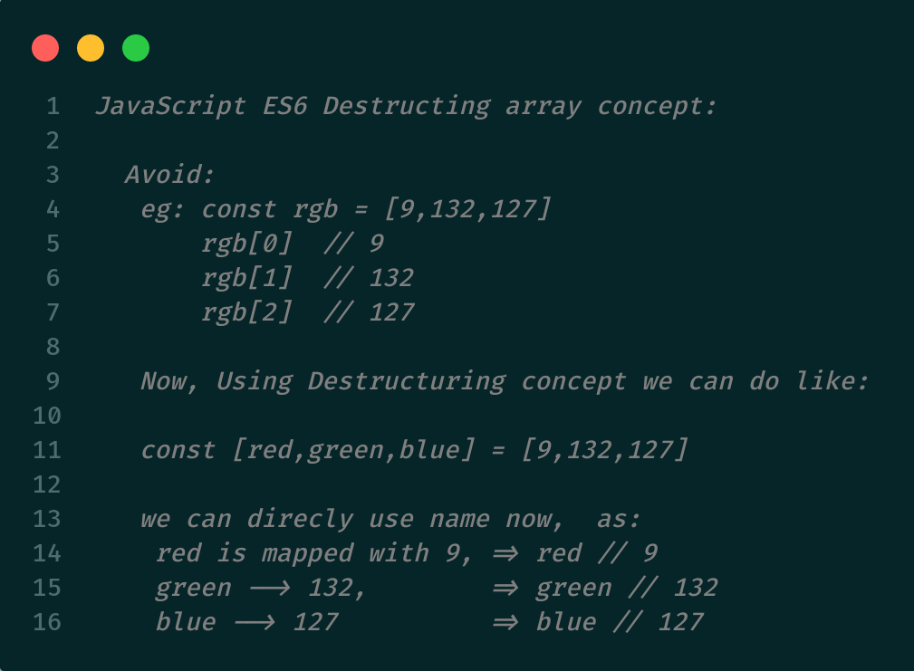

# Learning React From Basics

#### *Anyone can understand the folder structure and working of JSX and React from it*

### 1. To use these folders locally:

##### PS: *`Node.js`* must be installed on your system!!

1. Go to **Basics** folder, there are ordered sub-folders for learning essential concepts of React.
2. Now open that particular subfolder *(you want to learn)* in terminal *(preferably VS code)*
    
   eg: ``$Downloads/Basics/1.introduction-to-jsx/``
3. Then give command

    ```
    npm install
    ```

4. Then

    ```
    npm start
    ```  

5. It's done ! Play around with the files and see working.

#### **Note:** `package.json`  is one of the most important file. As one of the main purpose is Here you can see all the related dependencies (i.e, modules) which **node** is going to install when **`npm install`** command executed

<br>

### 2. Points to Remember:

- In `ReactDOM.render()` if Multiple html elements or Components are there, they need to be enclosed in either **jsx fragement** or **single div**

  - JSX fragments

    ```html
      <React.Fragment></React.Fragment>

      <></>
      ```

  - Single div

    ```html
    <div></div>
    ```
- React version 18 and above doesn't support ``ReactDOM.render()``, so now it's done using ``createRoot()`` after importing ``import ReactDOM from "react-dom/client";``
  
  - Old way:
    ```jsx
    import React from "react";
    import ReactDOM from "react-dom";
    import App from "./components/App";

    ReactDOM.render(<App />, document.getElementById("root"));
    ```
  - New way:
      ```jsx
      import React from "react";
      import ReactDOM from "react-dom/client";
      import App from "./components/App";

      const root = ReactDOM.createRoot(document.getElementById("root"));
      root.render(<App />);
      ```
- React newer version implementation is done from folder-15 (main changes will be done only in ``index.js``)

- **Let's Understand the FOLDER STRUCTURE:**

  At beginner level you only need to observe two folders
  `public`  and `src`

    - **public** : folder will be having the main file called ***index.html***
    and in that file `<div=class="root">` is where we will be rendering all of our react code using react and react-dom Modules.

   - **src** : folder will be having all the related react components ***(jsx, js files)***.
      in which mainly we'll usually looking at `App.js` file.<br>

- **In Folder-16 (``16.mapping-component-practice``):**
  
    We'll be learning about mapping and creating basic ***``emojipedia``*** like this:

  
  &nbsp 

- **In Folder-22 (``22.usestate-hook``):**
    
    We'll learn about states and there we'll explore the concept of *ES6 JavaScript Destructuring array.*


    Here is the reference <a href="https://developer.mozilla.org/en-US/docs/Web/JavaScript/Reference/Operators/Destructuring_assignment" target="_blank">Link</a>
    

    sample snap:
    
    
    
    

 - When we pass function as arugumet in another function or anywhere I guess then don't use paranthesis with function_name, just simply write function_name,
  
   eg:
      ```js
      function update(){
        .....
        .....
      }

      setInterval(update(),1000); // Won't work

      setInterval(update,1000); // Works fine
      ```
  